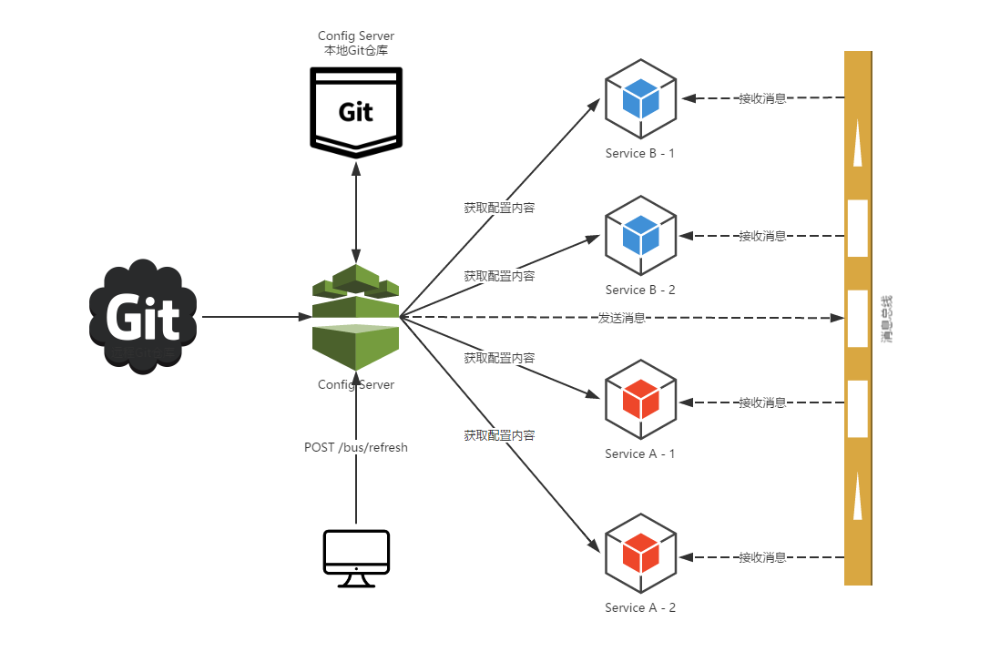

配置中心
---------

## 关键词

`配置中心、消息`

## 简介

### 配置中心架构

* 本例是配置中心+消息中间件实现配置动态刷新到各应用节点。



### 配置中心服务端

远程仓库地址：https://gitee.com/toopoo/config.git

RabbitMQ主要用来实现动态刷新通信。

*. pom依赖引入
```xml
        <dependency>
            <groupId>org.springframework.boot</groupId>
            <artifactId>spring-boot-starter-actuator</artifactId>
        </dependency>
        <!--配置中心-->
        <dependency>
            <groupId>org.springframework.cloud</groupId>
            <artifactId>spring-cloud-config-server</artifactId>
        </dependency>
```

* springboot配置文件application.yml，指定git仓库作为配置文件存储，配置中心服务端启动时会到远程git拉取配置文件到本地

```yaml
spring:
  application:
    name: config-server
  cloud:
    config:
      server:
        git:
          uri: https://git.oschina.net/toopoo/config.git
          searchPaths: /
  rabbitmq:
    host: ${RABBIT_MQ_HOST:localhost}
    port: ${RABBIT_MQ_PORT:5672}
    username: ${RABBIT_MQ_USERNAME:guest}
    password: ${RABBIT_MQ_PASSWORD:guest}

```

### 客户端使用

客户端引用配置如下代码，具体请参考 [producer](../../services/producer)子模块，配置中心客户端在启动时会从配置中心拉取相关配置文件 

* 引入依赖包

```xml
        <!--配置中心客户端-->
        <dependency>
            <groupId>org.springframework.cloud</groupId>
            <artifactId>spring-cloud-starter-config</artifactId>
        </dependency>
```

* 添加配置文件bootstrap.yml，添加配置中心的信息

```yaml
spring:
  cloud:
    config:
      name: eureka-producer  //git中配置文件的名字(应用名)
      label: master          //git仓库的分支名
      profile: test          //git中配置文件的环境
      enabled: true          //远程配置中心打开状态
      fail-fast: false       //当配置中心不可用时，快速失败
      retry:
        max-attempts: 6      //当配置中异常时，重试的次数
    bus:
      trace:
        enabled: true        //打开配置中心trace,方便记录配置变化情况
```
以上配置表示，启动时应用会获取git仓库中master分支下eureka-producer-test.properties文件中的配置

规则为：{name}-{profile}.properties

@Value会将配置文件中的值赋值。

@RefreshScope表示refresh配置时，要更新该类引用的配置项（不写不会动态更新）

```java
@RefreshScope
public class ProductService implements IProductService {

    @Autowired
    private ProductMapper productMapper;

    @Value("${username}")
    private String value;
}
```

* 配置动态刷新过程如下：

1. 运维人员更新git仓库配置文件。
2. 运维人员触发配置中心refresh。
3. 配置中心通过rabbitmq消息通知各应用。
4. 各应用接收到配置更新消息信息，主动拉取配置中心最新的配置并更新数据。

## 测试

* 刷新缓存

```
➜  springCloud git:(master) ✗ curl -i -X POST http://localhost:8888/actuator/bus-refresh

HTTP/1.1 204
Date: Sat, 11 Aug 2018 04:06:35 GMT

```

