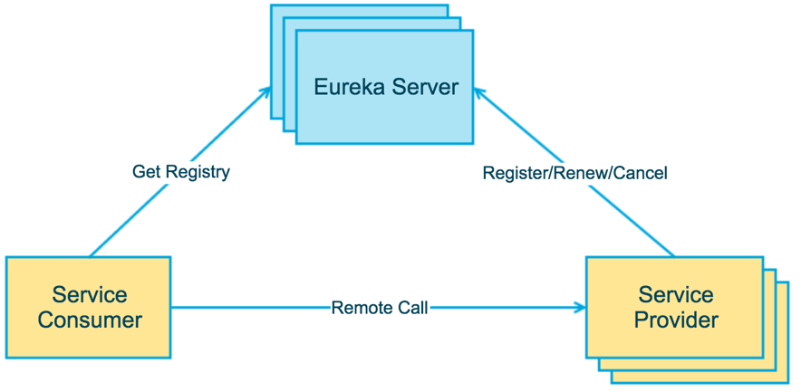
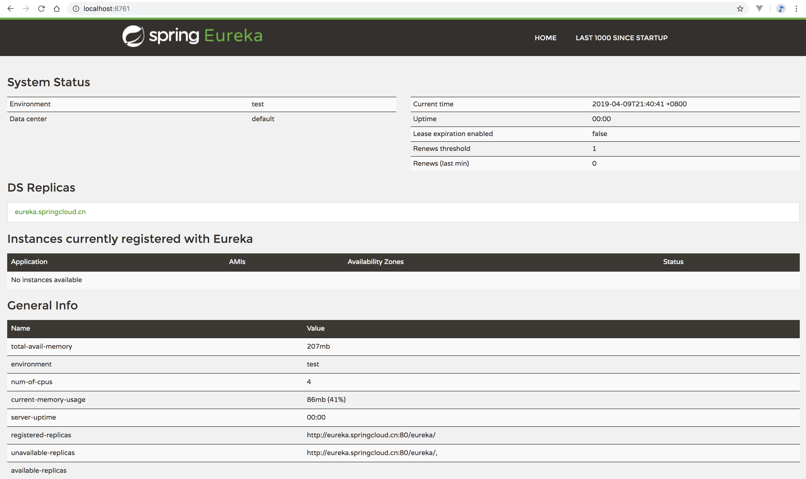

注册中心应用
----------

## 关键词

`注册中心、服务发现、服务注册`

## 简介

Eureka是Netflix开源的一款提供服务注册和发现的产品，它提供了完整的Service Registry和Service Discovery实现。也是springcloud体系中最重要最核心的组件之一。

服务中心又称注册中心，管理各种服务功能包括服务的注册、发现等。



上图简要描述了Eureka的基本架构，由3个角色组成：

1、Eureka Server

提供服务注册和发现的Server

2、Service Provider ：服务提供方

将自身服务注册到Eureka，从而使服务消费方能够找到

3、Service Consumer：服务消费方

从Eureka获取注册服务列表，从而能够消费服务

## 启动

### 先决条件

- [rabbitmq](http://rabbitmq.io/download)

### 启动命令

进入应用目录

启动命令：`mvn spring-boot:run`

docker镜像打包：`mvn docker:build`

## 使用指南

### 控制台查看

浏览器中打开`http://localhost:8761`，可以看到注册中心的一些信息，如目前注册的应用，应用上下线的记录。




### 客户端注册

Provider和Consumer注册到注册中心需要添加的eureka client包，并添加注册中心的配置, 如下

pom.xml

```
<!--注册中心-->
<dependency>
    <groupId>org.springframework.cloud</groupId>
    <artifactId>spring-cloud-starter-netflix-eureka-client</artifactId>
</dependency>
```

application.yml

```
eureka:
  client:
    serviceUrl:
      defaultZone: http://localhost:8761/eureka/
```
