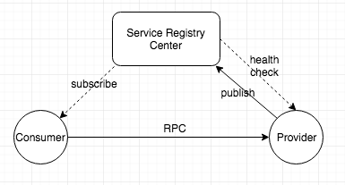
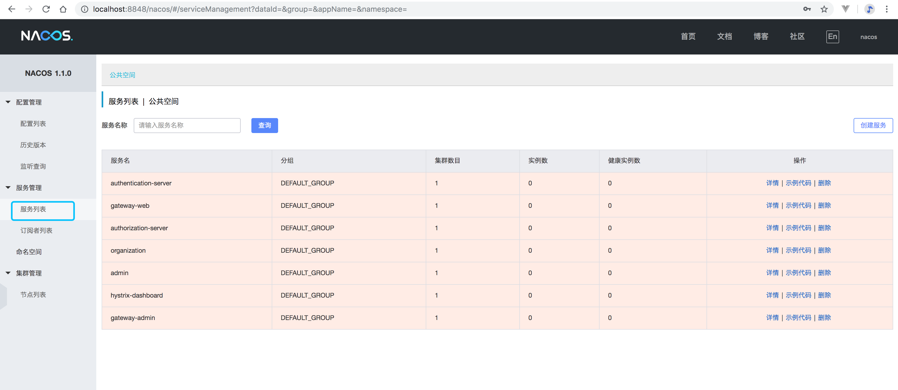

注册中心
----------

## 关键词

`注册中心、服务发现、服务注册`

## 简介

本项目造型采用Nacos为注册中心，Nacos是阿里巴巴开源的注册中心、配置中心。致力于帮助您发现、配置和管理微服务。Nacos 提供了一组简单易用的特性集，帮助您快速实现动态服务发现、服务配置、服务元数据及流量管理等。

[Nacos官网地址](https://nacos.io/zh-cn/index.html)




上图简要描述了Eureka的基本架构，由3个角色组成：

1、Register Server

提供服务注册和发现的Server

2、Service Provider ：服务提供方

将自身服务注册到注册中心，从而使服务消费方能够找到

3、Service Consumer：服务消费方

从注册中心中获取注册服务列表，从而能够消费服务

## 启动

### 先决条件

本项目采用docker快速搭建一个可用的开发环境

- [docker](https://www.docker.com)

### 启动命令

进入docker-compose目录

执行命令：`docker-compose -f docker-compose.yml -f docker-compose.nacos.yml up nacos`

## 使用指南

### 控制台查看

浏览器中打开`http://localhost:8848`，可以看到注册中心的一些信息，如目前注册的应用，应用上下线的情况。




### 客户端注册

Provider和Consumer注册到注册中心需要添加的nacos client包，并添加注册中心的配置, 如下

pom.xml

```
<dependencyManagement>
    <dependencies>
        <!--支持Spring Boot 2.1.X-->
        <dependency>
            <groupId>org.springframework.boot</groupId>
            <artifactId>spring-boot-dependencies</artifactId>
            <version>2.1.4.RELEASE</version>
            <type>pom</type>
            <scope>import</scope>
        </dependency>
        <dependency>
            <groupId>org.springframework.cloud</groupId>
            <artifactId>spring-cloud-dependencies</artifactId>
            <version>Greenwich.RELEASE</version>
            <type>pom</type>
            <scope>import</scope>
        </dependency>
        <dependency>
            <groupId>com.alibaba.cloud</groupId>
            <artifactId>spring-cloud-alibaba-dependencies</artifactId>
            <version>2.1.0.RELEASE</version>
            <type>pom</type>
            <scope>import</scope>
        </dependency>
    </dependencies>
</dependencyManagement>
<!--注册中心-->
<dependencies>
    <dependency>
        <groupId>com.alibaba.cloud</groupId>
        <artifactId>spring-cloud-alibaba-nacos-discovery</artifactId>
    </dependency>
</dependencies>
```

application.yml

```
spring:
  cloud:
    nacos:
      discovery:
        server-addr: ${REGISTER_HOST:localhost}:${REGISTER_PORT:8848}
```
