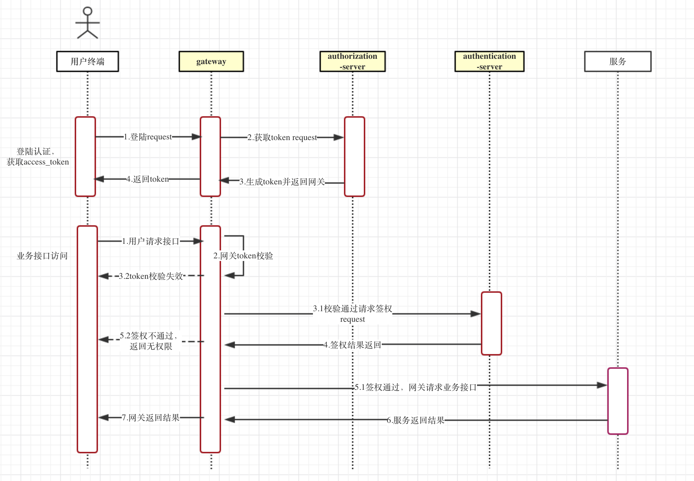

网关子项目简介
---------

## 关键词

springcloud gateway、RateLimiter（限流）、动态路由、网关

## 简介

SpringCloud Gateway是基于Spring Framework 5，Project Reactor和Spring Boot 2.0构建，目标是用于替代zuul。本项目网关管理端应用如下：

| 服务名             |   简介              |  默认地址                |
|--------------------|---------------------|--------------------------|
| gateway-admin      | 网关管理应用        |  http://localhost:8445   |
| gateway-web        | 网关入口应用        |  http://localhost:8443   |

gateway-admin下 `src/main/db` 脚本是动态路由的存储结构，启动项目前先建立好库和表

## 架构

所有服务对外提供服务原则上全都从gateway出，进行统一管理和控制。

## 使用指南

[网关管理应用文档](./gateway-admin) 

[网关应用文档](./gateway-web) 
