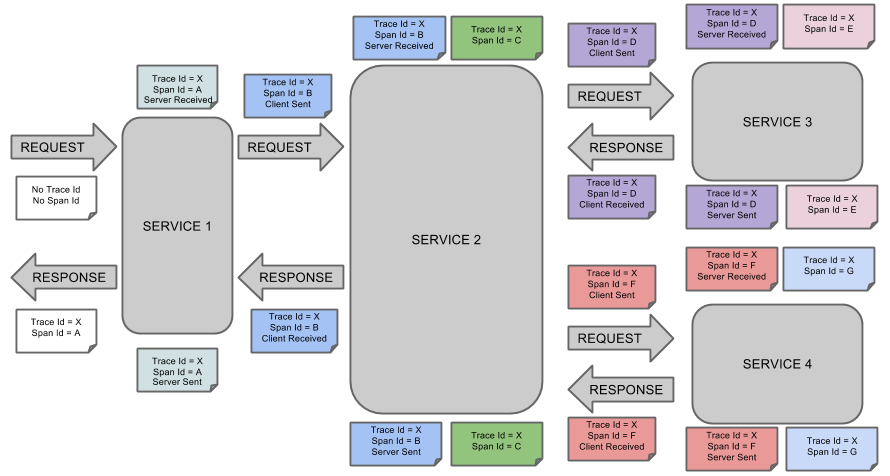
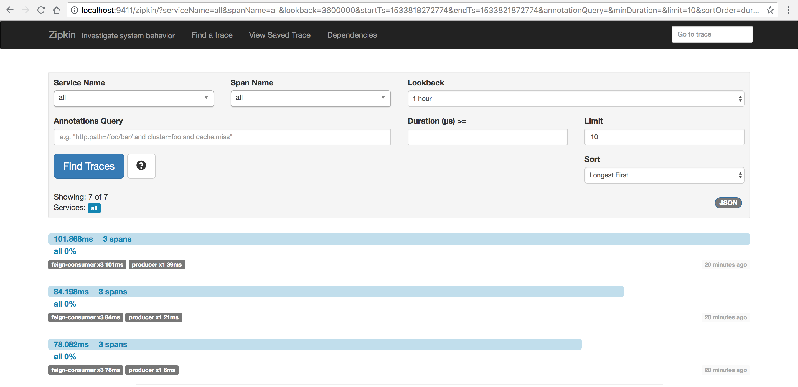
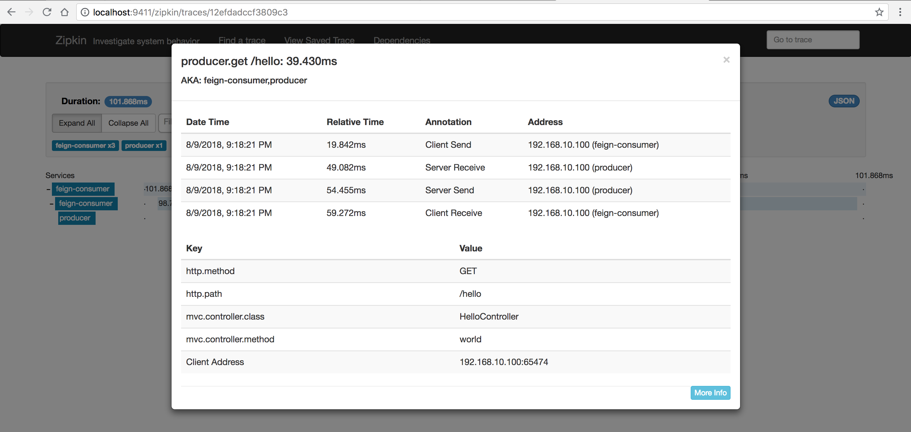
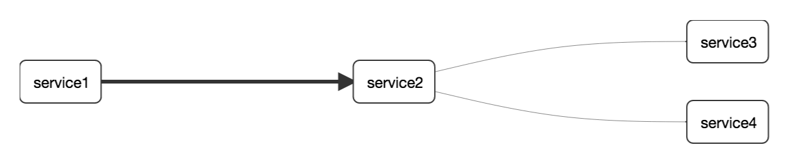
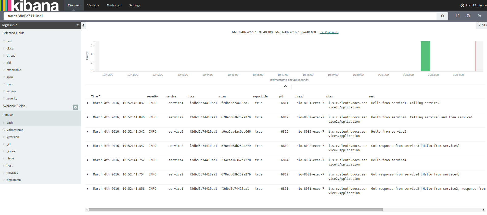
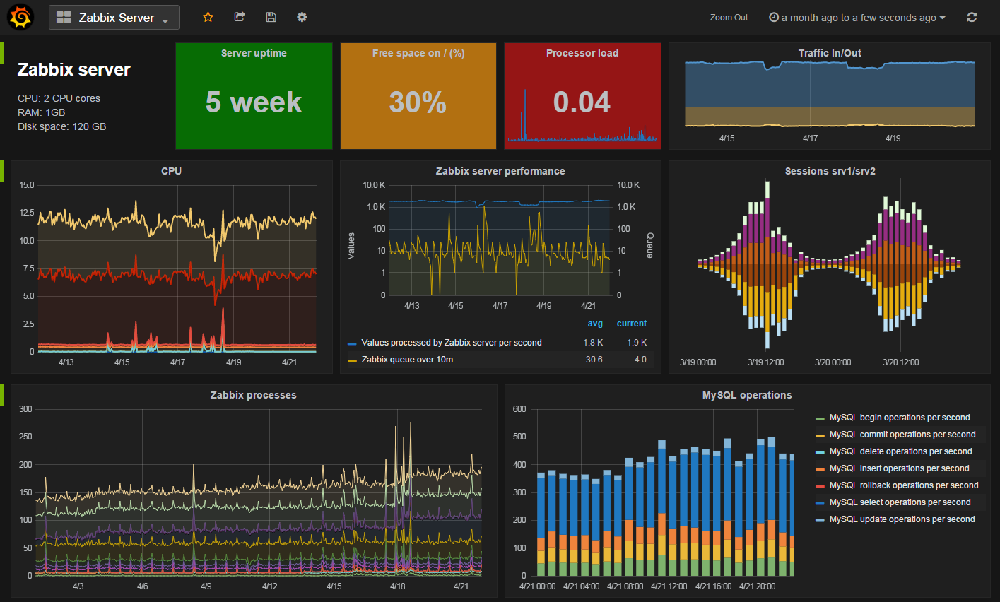

快速构建spring-cloud + sleuth + rabbit + zipkin + es + kibana + grafana日志跟踪平台
-------------

## 简介

 ### Spring-Cloud-Sleuth
  
 Spring-Cloud-Sleuth是Spring Cloud的组成部分之一，为SpringCloud应用实现了一种分布式追踪解决方案，其兼容了Zipkin, HTrace和log-based追踪
 
 * 术语(Terminology)
 
 **Span：** 基本工作单元，例如，在一个新建的span中发送一个RPC等同于发送一个回应请求给RPC，span通过一个64位ID唯一标识，trace以另一个64位ID表示，span还有其他数据信息，比如摘要、时间戳事件、关键值注释(tags)、span的ID、以及进度ID(通常是IP地址)
 
 span在不断的启动和停止，同时记录了时间信息，当你创建了一个span，你必须在未来的某个时刻停止它。
 
 **Trace：** 一系列spans组成的一个树状结构，例如，如果你正在跑一个分布式大数据工程，你可能需要创建一个trace。
 
 **Annotation：** 用来及时记录一个事件的存在，一些核心annotations用来定义一个请求的开始和结束
 
 cs - Client Sent -客户端发起一个请求，这个annotion描述了这个span的开始
 sr - Server Received -服务端获得请求并准备开始处理它，如果将其sr减去cs时间戳便可得到网络延迟
 ss - Server Sent -注解表明请求处理的完成(当请求返回客户端)，如果ss减去sr时间戳便可得到服务端需要的处理请求时间
 cr - Client Received -表明span的结束，客户端成功接收到服务端的回复，如果cr减去cs时间戳便可得到客户端从服务端获取回复的所有所需时间
 
 将Span和Trace在一个系统中使用Zipkin注解的过程图形化：
 
 
 
 ### Rabbitmq: 消息队列，主要用于传输日志
 
 
 ### Zipkin: 服务调用链路追踪系统，聚合各业务系统调用延迟数据，达到链路调用监控与跟踪。

 服务调用链路
 
 
 服务调用链路详情
 
 
 服务间的调用关系
 

 ### ES + Kibana提供搜索、查看和与存储在 Elasticsearch 索引中的数据进行交互的功能。开发者或运维人员可以轻松地执行高级数据分析，并在各种图表、表格和地图中可视化数据。
 
 

 ### Grafana可视化图表监控工具
 
  
  

## zipkin-server搭建与使用

docker-compose

```yaml
version: '3'
services:
  rabbitmq:
    image: rabbitmq:alpine
    container_name: sc-rabbitmq
    restart: always
    volumes:
      - ./data/rabbitmq:/var/lib/rabbitmq
    networks:
      - sc-net
    ports:
      - 5672:5672
      
  zipkin-server:
    image: openzipkin/zipkin
    container_name: sc-zipkin-server
    restart: always
    volumes:
      - ./data/logs/zipkin-server:/logs
    networks:
      - sc-net
    ports:
      - 9411:9411
    environment:
      - RABBIT_ADDRESSES=rabbitmq:5672
      - RABBIT_MQ_PORT=5672
      - RABBIT_PASSWORD=guest
      - RABBIT_USER=guest
    depends_on:
      - rabbitmq

```
## 搭建ES + Grafana
```yaml
version: '3'
services:
  elasticsearch:
    image: elasticsearch:alpine
    container_name: sc-elasticsearch
    restart: always
    volumes:
      - ./data/elasticsearch/logs:/var/logs/elasticsearch
    networks:
      - sc-net
    ports:
      - 9200:9200

  kibana:
    image: kibana
    container_name: sc-kibana
    restart: always
    volumes:
      - ./data/kibana/logs:/var/logs/kibana
    networks:
      - sc-net
    ports:
      - 5601:5601
    environment:
      - ELASTICSEARCH_URL=http://elasticsearch:9200
    depends_on:
      - elasticsearch

  grafana:
    image: grafana/grafana
    container_name: sc-grafana
    restart: always
    volumes:
      - ./data/grafana/logs:/var/logs/grafana
    networks:
      - sc-net
    ports:
      - 3000:3000
```

## 测试

### 启动服务

将以上docker-compose脚本保存为ocker-compose.yml,并在当时目录下执行`docker-compose up`

### spring-cloud集成

请参考：https://github.com/zhoutaoo/SpringCloud例子

应用集成开发好后，请求应用的接口

### 查看日志

zipkin访问地址：http://localhost:9411，可以看到请求的耗时与路径

kibana访问地址：http://localhost:5601，可以看到请求打印的日志

grafana访问地址：http://localhost:3000，可以新增es数据源，出可视化的图表和监控


